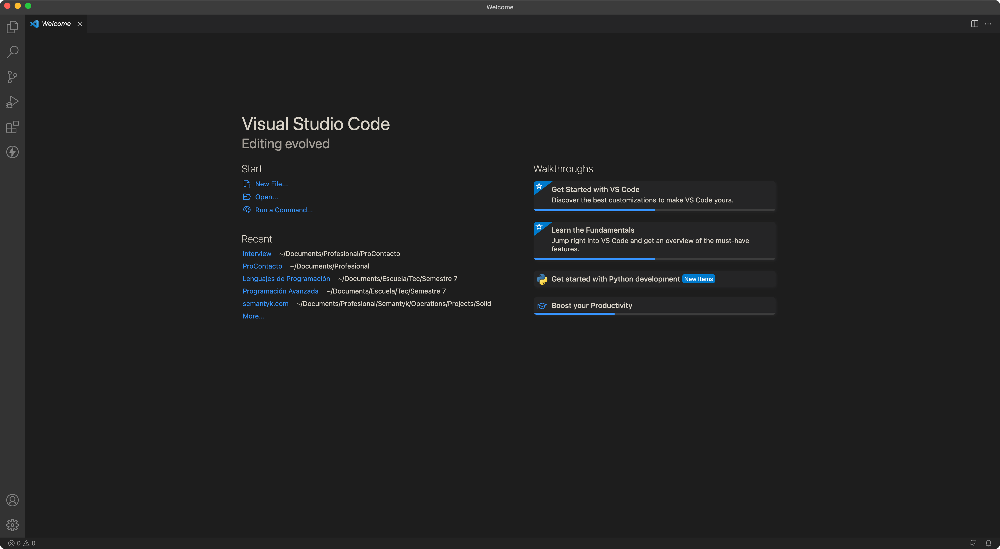
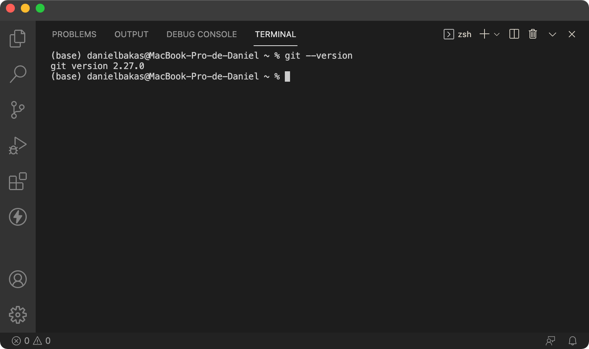
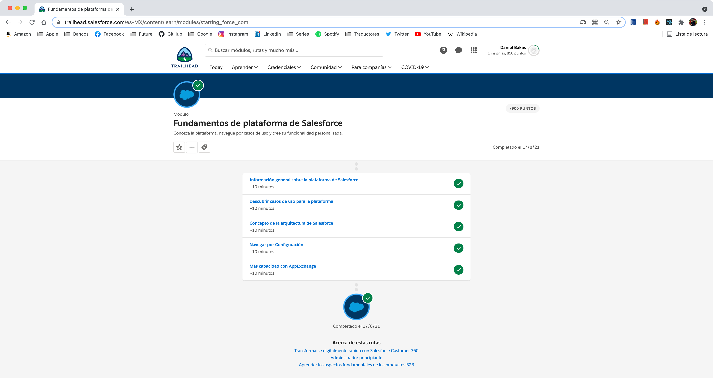
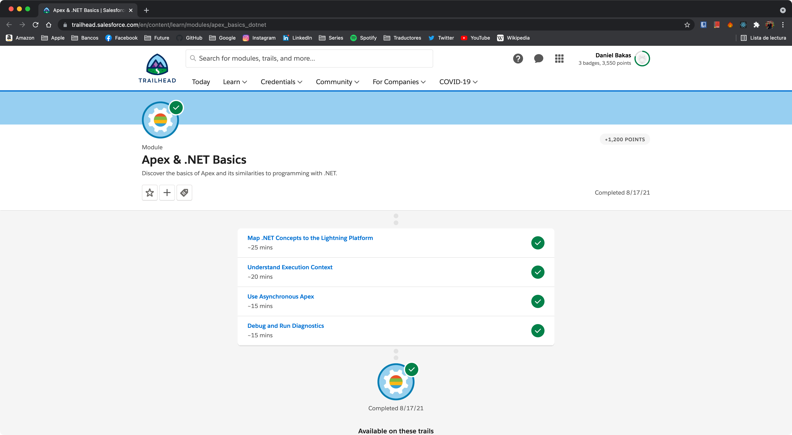
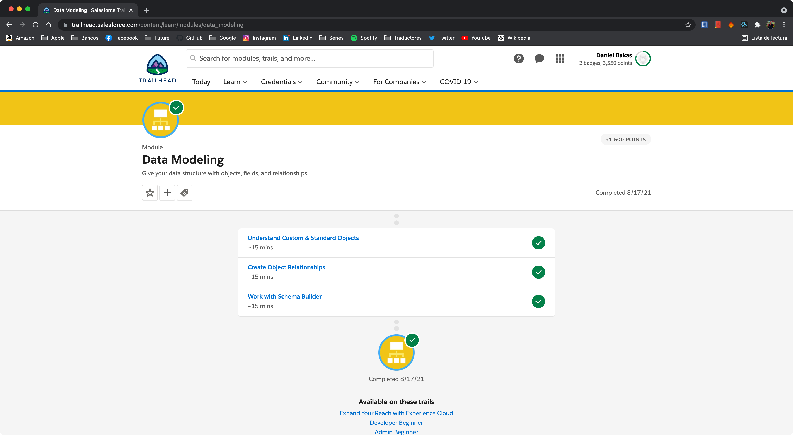

# Ejercicios | ProContacto
Este documento contiene la solución de los diversos ejercicios planteados por la empresa ProContacto como parte del proceso de evaluación inicial.

***
## Índice
- [Ejercicios | ProContacto](#ejercicios--procontacto)
  - [Índice](#índice)
  - [1. Instalación del ambiente](#1-instalación-del-ambiente)
    - [1.1. Entorno de Desarrollo Integrado (IDE)](#11-entorno-de-desarrollo-integrado-ide)
    - [1.2. Herramienta de Control de Versiones (Git y Git Bash)](#12-herramienta-de-control-de-versiones-git-y-git-bash)
  - [2. Cuestionario de Protocolo HTTP](#2-cuestionario-de-protocolo-http)
  - [3. POSTMAN](#3-postman)
    - [3.1. GET Request Inicial](#31-get-request-inicial)
    - [3.1. POST Request con Body](#31-post-request-con-body)
    - [3.1. GET Request Final](#31-get-request-final)
    - [¿Qué diferencias se observan entre las llamadas el punto 1 y 3?](#qué-diferencias-se-observan-entre-las-llamadas-el-punto-1-y-3)
  - [4. Módulos de Trailhead](#4-módulos-de-trailhead)
    - [4.1. Fundamentos de Plataforma de Salesforce](#41-fundamentos-de-plataforma-de-salesforce)
    - [4.2 Fundamentos de Apex y .NET](#42-fundamentos-de-apex-y-net)
    - [4.3 Modelado de datos](#43-modelado-de-datos)
    - [4.4 Fundamentos y base de datos de Apex](#44-fundamentos-y-base-de-datos-de-apex)
    - [4.5 Desencadenadores de Apex](#45-desencadenadores-de-apex)
    - [4.6 Apex Integration Services](#46-apex-integration-services)
  - [5. Definiciones y Diagramas](#5-definiciones-y-diagramas)
  - [6. Actividades sobre el Playground](#6-actividades-sobre-el-playground)
  - [7. Cuestionario de Salesforce](#7-cuestionario-de-salesforce)
    - [7.1. Soluciones](#71-soluciones)
    - [7.2. Funcionalidades](#72-funcionalidades)
    - [7.3. Conceptos generales](#73-conceptos-generales)

***
## 1. Instalación del ambiente
### 1.1. Entorno de Desarrollo Integrado (IDE)

### 1.2. Herramienta de Control de Versiones (Git y Git Bash)

***
## 2. Cuestionario de Protocolo HTTP
- ¿Qué es un servidor HTTP? 
- ¿Qué son los verbos HTTP? Mencionar los más conocidos
- ¿Qué es un request y un response en una comunicación HTTP? ¿Qué son los headers? 
- ¿Qué es un queryString? (En el contexto de una url)
- ¿Qué es el responseCode? ¿Qué significado tiene los posibles valores devueltos?
- ¿Cómo se envía la data en un Get y cómo en un POST? 
- ¿Qué verbo http utiliza el navegador cuando accedemos a una página?
- Explicar brevemente qué son las estructuras de datos JSON y XML dando ejemplo de estructuras posibles.
- Explicar brevemente el estándar SOAP
- Explicar brevemente el estándar REST Full
- ¿Qué son los headers en un request? ¿Para qué se utiliza el key Content-type en un header?

***
## 3. POSTMAN
### 3.1. GET Request Inicial
### 3.1. POST Request con Body
### 3.1. GET Request Final
### ¿Qué diferencias se observan entre las llamadas el punto 1 y 3?

***
## 4. Módulos de Trailhead
- Enlace al Perfil: [https://trailblazer.me/id/danielbakas](https://trailblazer.me/id/danielbakas)
### 4.1. Fundamentos de Plataforma de Salesforce

### 4.2 Fundamentos de Apex y .NET

### 4.3 Modelado de datos

### 4.4 Fundamentos y base de datos de Apex
### 4.5 Desencadenadores de Apex
### 4.6 Apex Integration Services

***
## 5. Definiciones y Diagramas
- Lead
- Account
- Contact
- Opportunity
- Product
- PriceBook
- Quote
- Asset
- Case
- Article

***
## 6. Actividades sobre el Playground

***
## 7. Cuestionario de Salesforce
### 7.1. Soluciones
- ¿Qué es Salesforce?
- ¿Qué es Sales Cloud?
- ¿Qué es Service Cloud?
- ¿Qué es Health Cloud?
- ¿Qué es Marketing Cloud?
### 7.2. Funcionalidades
- ¿Qué es un RecordType?
- ¿Qué es un ReportType?
- ¿Qué es un Page Layout?
- ¿Qué es un Compact Layout?
- ¿Qué es un Perfil?
- ¿Qué es un Rol?
- ¿Qué es un Validation Rule?
- ¿Qué diferencia hay entre una relación Master Detail y Lookup?
- ¿Qué es un Sandbox?
- ¿Qué es un ChangeSet?
- ¿Para qué sirve el import Wizard de Salesforce?
- ¿Para qué sirve la funcionalidad Web to Lead?
- ¿Para qué sirve la funcionalidad Web to Case?
- ¿Para qué sirve la funcionalidad Omnichannel?
- ¿Para qué sirve la funcionalidad Chatter?
### 7.3. Conceptos generales
- ¿Qué significa SaaS? ¿Salesforce es Saas?
- ¿Qué significa que una solución sea Cloud?
- ¿Qué significa que una solución sea On-Premise?
- ¿Qué es un pipeline de ventas?
- ¿Qué es un funnel de ventas?
- ¿Qué significa Customer Experience?
- ¿Qué significa omnicanalidad?
- ¿Qué significa que un negocio sea B2B?
- ¿Qué significa que un negocio sea B2C?
- ¿Qué es un KPI?
- ¿Qué es una API y en qué se diferencia de una Rest API?
- ¿Qué es un Proceso Batch?
- ¿Qué es Kanban?
- ¿Qué es un ERP? ¿Salesforce es un ERP?