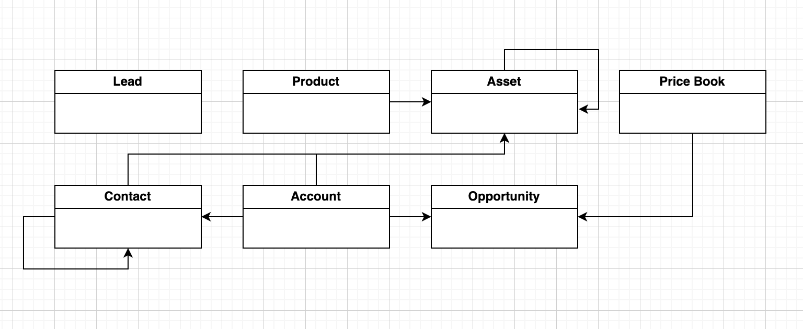
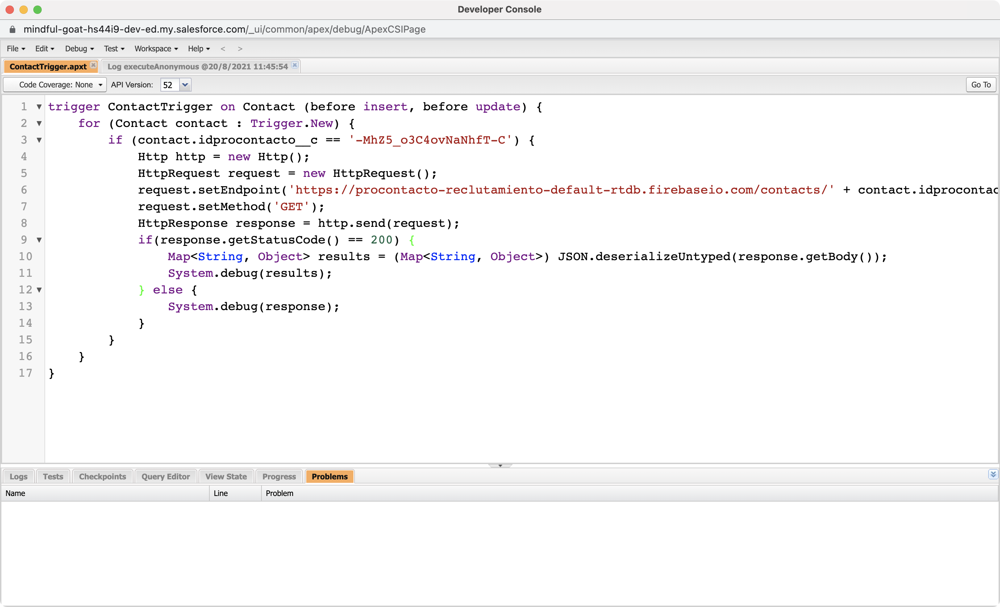

# Ejercicios | ProContacto
Este documento contiene la solución de los diversos ejercicios planteados por la empresa ProContacto como parte del proceso de evaluación inicial.

***
## Índice
- [Ejercicios | ProContacto](#ejercicios--procontacto)
  - [Índice](#índice)
  - [1. Instalación del ambiente](#1-instalación-del-ambiente)
    - [1.1. Entorno de Desarrollo Integrado (IDE)](#11-entorno-de-desarrollo-integrado-ide)
    - [1.2. Herramienta de Control de Versiones (Git y Git Bash)](#12-herramienta-de-control-de-versiones-git-y-git-bash)
  - [2. Cuestionario de Protocolo ```HTTP```](#2-cuestionario-de-protocolo-http)
  - [3. POSTMAN](#3-postman)
    - [3.1. ```GET``` Request Inicial](#31-get-request-inicial)
    - [3.2. ```POST``` Request con Body](#32-post-request-con-body)
    - [3.3. ```GET``` Request Final](#33-get-request-final)
    - [¿Qué diferencias se observan entre las llamadas el punto 1 y 3?](#qué-diferencias-se-observan-entre-las-llamadas-el-punto-1-y-3)
  - [4. Módulos de Trailhead](#4-módulos-de-trailhead)
    - [4.1. Fundamentos de Plataforma de Salesforce](#41-fundamentos-de-plataforma-de-salesforce)
    - [4.2 Fundamentos de Apex y .NET](#42-fundamentos-de-apex-y-net)
    - [4.3 Modelado de datos](#43-modelado-de-datos)
    - [4.4 Fundamentos y base de datos de Apex](#44-fundamentos-y-base-de-datos-de-apex)
    - [4.5 Desencadenadores de Apex](#45-desencadenadores-de-apex)
    - [4.6 Apex Integration Services](#46-apex-integration-services)
  - [5. Objetos y Relaciones](#5-objetos-y-relaciones)
    - [5.1. Definiciones de Objetos](#51-definiciones-de-objetos)
    - [5.2. Diagrama de Relaciones](#52-diagrama-de-relaciones)
  - [6. Actividades sobre el Playground](#6-actividades-sobre-el-playground)
  - [7. Cuestionario de Salesforce](#7-cuestionario-de-salesforce)
    - [7.1. Soluciones](#71-soluciones)
    - [7.2. Funcionalidades](#72-funcionalidades)
    - [7.3. Conceptos generales](#73-conceptos-generales)
  - [8. Referencias](#8-referencias)

***
## 1. Instalación del ambiente
### 1.1. Entorno de Desarrollo Integrado (IDE)

### 1.2. Herramienta de Control de Versiones (Git y Git Bash)


***
## 2. Cuestionario de Protocolo ```HTTP```
- **¿Qué es un servidor ```HTTP```?**
  -  Hardware: Es un equipo de computación que almacena los archivos de un sitio web (ej.  documentos HTML , imágenes, hojas de estilos CSS y archivo JavaScript) y los entrega al dispositivo del usuario final. Está conectado a internet y es accesible a través de un nombre de dominio como "google.com".
  -  Software: Es una pieza de software que comprende URLs (direcciones web) y ```HTTP``` (el protocolo que los navegador usan para renderizar las páginas web).
- **¿Qué son los verbos ```HTTP```? Mencionar los más conocidos**
  - **Definición**: Son palabras clave para identificar la acción a realizar a partir de una solicitud ```HTTP```. Cada verbo tiene un objetivo diferente y la respuesta del servidor es distinta para cada uno.
  - **Verbos**:
    - **```GET```**: Solicita una representación de un recurso específico. Las peticiones que usan el método ```GET``` sólo deben recuperar datos.
    - **HEAD**: Similar a ```GET```, solicita la cabecera o head  de un recurso específico. Las peticiones que usan el método HEAD sólo deben recuperar datos.
    - **```POST```**: Envía datos a un recurso existente, causando a menudo un cambio en el estado o efectos secundarios en el servidor. Las peticiones que usan el método ```POST``` deben enviar datos.
    - **```PUT```**: Envía datos para crear un nuevo recurso en específico. Las peticiones que usan el método ```PUT``` deben enviar datos.
    - **```DELETE```**: Solicita el borrado de un recurso específico. Las peticiones que usan el método ```DELETE``` no envían ni solicitan datos más que el identificador del recurso.
    - **```CONNECT```**: Establece un túnel hacia el servidor identificado por el recurso.
    - **```OPTIONS```**: Es utilizado para describir las opciones de comunicación para el recurso de destino.
    - **TRACE**: Realiza una prueba de bucle de retorno de mensaje a lo largo de la ruta al recurso de destino.
    - **```PATCH```**: Se usa para aplicar modificaciones parciales a un recurso.
- **¿Qué es un request y un response en una comunicación ```HTTP```?**
  - **Request**: Es una solicitud a un servidor ```HTTP``` utilizando alguno de los verbos anteriores, además de datos adicionales como la cabecera (head) de la solicitud y el cuerpo (body), la cual se realiza con el objetivo de recibir una respuesta por parte del servidor con información relevante denominada ***response***.
  - **Response**: Es la respuesta a una solicitud ```HTTP``` (***request***) la cual regresa un código de estado (status code) que representa el estado de la solicitud, así como los datos correspondientes a la misma.
- **¿Qué son los headers?**
  - Son un elemento de una solicitud (request) o respuesta (response) de un servidor ```HTTP```. Transmiten información relevante acerca del navegador del cliente, de la página solicitada, del servidor, y más.
- **¿Qué es un queryString?** (En el contexto de una url)
  - Es una colección de parámetros y valores relevantes para el manejo de datos de una solicitud ```HTTP```, formateados y codificados para conformar con los estándares de URL, así como la estructura requerida para ser consumidos por la API o el servidor.
- **¿Qué es el responseCode? ¿Qué significado tiene los posibles valores devueltos?**
  - **Definición**: Son los códigos de estado de respuesta de una solicitud ```HTTP```. Indican si se ha completado satisfactoriamente una solicitud ```HTTP``` específica. 
  - **Clases**: Se agrupan en cinco clases.
    - **Respuestas informativas** (100–199). P.ej:
      - ```100: Continue```
      - ```101: Switching Protocol```
      - ```102: Processing```
      - y más.
    - **Respuestas satisfactorias** (200–299). P.ej:
      - ```200: OK```
      - ```201: Created```
      - ```202: Accepted```
      - ```203: Non-Authoritative Information```
      - y más.
    - **Redirecciones** (300–399). P.ej:
      - ```300: Multiple Choice```
      - ```301: Moved Permanently```
      - ```302: Found```
      - ```303: See Other```
      - y más.
    - **Errores de los clientes** (400–499). P.ej:
      - ```400: Bad Request```
      - ```401: Unauthorized```
      - ```402: Payment Required```
      - ```403: Forbidden```
      - ```404: Not Found```
      - y más.
    - **Errores de los servidores** (500–599). P.ej:
      - ```500: Internal Server Error```
      - ```501: Not Implemented```
      - ```502: Bad Gateway```
      - ```503: Service Unavailable```
      - y más.
- **¿Cómo se envía la data en un ```GET``` y cómo en un ```POST```?**
  - **```GET```**: Para realizar una solicitud ```GET``` se deben especificar:
      - Los tipos de datos que se espera recibir en la respuesta (response) a partir del parametro ```Content-Type```. P.ej: ```Accept: application/json``` , 
    -  Los tipos de datos que se están enviando en la respuesta (response) a partir del parametro ```Content-Type```. P.ej: ```Content-Type: application/json```
    -  El punto final (representado por una URL) del recurso específico que se busca recuperar
   - **```POST```**: Para realizar una solicitud ```POST``` se deben especificar:
     - Todos los elementos de la cabecera del método ```GET```
     - El cuerpo (body) que contiene los datos de la solicitud.
- **¿Qué verbo http utiliza el navegador cuando accedemos a una página?**
  - Para recuperar una página de un sitio web, se utiliza el método ```GET``` con la dirección URL de la página web o recurso que se está buscando acceder.
- **Explicar brevemente qué son las estructuras de datos JSON y XML dando ejemplo de estructuras posibles.**
  - **Notación de Objetos JavaScript (```JSON```)**: Es un formato ligero para el almacenamiento y transferencia de datos. Se utiliza frecuentemente cuando se envían datos de un servidor relacionados a una página web.
  - **Lenguaje de Marcado Extensible (```XML```)**: Es un formato para el almacenamiento y transferencia de datos. No está predefinido, por lo es necesario definir etiquetas propias. El propósito principal del lenguaje es compartir datos a través de diferentes sistemas, como Internet.
- **Explicar brevemente el estándar SOAP**
  - **Protocolo Simple de Acceso a Objetos (SOAP)**: Es un protocolo estándar que creado originalmente para permitir la comunicación entre las aplicaciones diseñadas con diferentes lenguajes y en diferentes plataformas.
- **Explicar brevemente el estándar REST Full**:
  - **Transferencia de Estado Representacional (REST)**: Es un conjunto de principios arquitectónicos de software que se ajusta a las necesidades de los servicios web y las aplicaciones móviles ligeros.
- **¿Qué son los headers en un request?**
  - Son un elemento de una solicitud (request) o respuesta (response) de un servidor ```HTTP```. Transmiten información relevante acerca del navegador del cliente, de la página solicitada, del servidor, y más.
- **¿Para qué se utiliza el key Content-type en un header?**
  - Para especificar la estructura de datos del cuerpo (body) de datos que se está enviando en una solicitud ```HTTP```.

***
## 3. POSTMAN
### 3.1. ```GET``` Request Inicial

### 3.2. ```POST``` Request con Body

### 3.3. ```GET``` Request Final

### ¿Qué diferencias se observan entre las llamadas el punto 1 y 3?
- En la primera solicitud se recibieron todos los contactos existentes en el punto final (enpoint) proporcionado. A partir de la solicitud ```POST``` del paso [Paso 3.2.](#32-post-request-con-body) la cual se realizó para crear una nueva entrada en la base de datos, fue posible, a partir de la solicitud ```GET``` del paso [Paso 3.3.](#33-get-request-final), recuperar la colección actualizada de datos reflejando la nueva entrada con su contenido correspondiente. Esta entrada es la última del [Paso 3.3.](#33-get-request-final) en la que se puede apreciar el nombre ```Daniel``` como valor de la propiedad ```name```del último objeto, así como el correo ```daniel.bakas@procontacto.com.mx``` como valor de la propiedad ```email``` del mismo objeto.

***
## 4. Módulos de Trailhead
- Enlace al Perfil: [https://trailblazer.me/id/danielbakas](https://trailblazer.me/id/danielbakas)
### 4.1. Fundamentos de Plataforma de Salesforce

### 4.2 Fundamentos de Apex y .NET

### 4.3 Modelado de datos

### 4.4 Fundamentos y base de datos de Apex

### 4.5 Desencadenadores de Apex

### 4.6 Apex Integration Services


***
## 5. Objetos y Relaciones
### 5.1. Definiciones de Objetos
- **Lead**: Es un potencial cliente que demostró interés en un producto o servicio ofrecido por la marca a través de la interacción con contenidos y otros materiales. Además de ser una oportunidad de negocio, el lead es un recurso valioso en cualquier estratégia de marketing, pudiendo tornarse tanto un cliente como un abogado de la marca.
- **Account**: Representa una cuenta individual, que es una organización o persona involucrada con su negocio (como clientes, competidores y socios).
- **Contact**: Representa un contacto, que es una persona asociada a una cuenta.
- **Opportunity**: Representa una oportunidad de venta o una transacción pendiente.
- **Product**: Representa un objeto a la venta.
- **PriceBook**: Representa un libro de precios que contiene la lista de productos que una organización vende.
- **Quote**: Representa una cotización, es decir, un registro que muestra los precios propuestos para productos y servicios. Los presupuestos pueden crearse y sincronizarse con las oportunidades, y enviarse por correo electrónico en formato PDF a los clientes.
- **Asset**: Representa un artículo de valor comercial, como un producto vendido por su empresa o por un competidor, que un cliente ha comprado e instalado.
- **Case**: Representa un caso, es decir, un inconveniente o problema relacionado a un cliente.
- **Article**: Como tal no existe un objeto Article, pero existen:
  - **CaseArticle**: Representa la asociación entre un caso y un artículo de conocimiento.
  - **KnowledgeArticle**: Proporciona acceso de sólo lectura a un artículo y la posibilidad de eliminar el artículo maestro.
  - **LinkedArticle**: Representa un artículo de conocimiento que se adjunta a una orden de trabajo, una partida de orden de trabajo o un tipo de trabajo.

### 5.2. Diagrama de Relaciones



***
## 6. Actividades sobre el Playground
Desarrollar un trigger para que cuando un usuario Modifica o Crea un contacto de Salesforce completando el campo generado el punto B con el ID del punto A, se invoque al Web Service con el idprocontacto obtenga los datos de email de la respuesta y actualice el campo email del contacto. Usar Playground 1. 

Para consultar un contacto en particular se puede agregar al ID al final de la URL como en este ejemplo: https://procontacto-reclutamiento-default-rtdb.firebaseio.com/contacts/-Ma6nC5l7n2nVal2zCyR.json



***
## 7. Cuestionario de Salesforce
### 7.1. Soluciones
- **¿Qué es Salesforce?**
  - Salesforce es una solución de gestión de relaciones con clientes que une empresas y clientes. Es una plataforma CRM integrada que brinda a todos tus departamentos, incluidos marketing, ventas, comercio y servicios, una vista única y compartida de cada cliente.
- **¿Qué es Sales Cloud?**
  - Sales Cloud es un software de ventas y CRM en la nube, de la plataforma de Salesforce diseñado para volver más eficientes los procesos de ventas al centralizar la información de clientes, registrar sus interacciones con la organización y automatizar muchos de los procesos que los agentes de ventas realizan diariamente. 
- **¿Qué es Service Cloud?**
  - Service Cloud es un software de automatización de procesos de servicio en la nube, de la plataforma de Salesforce. Algunas de sus funciones son automatizar los procesos de servicio, agilizar los flujos de trabajo y sacar a la luz artículos, temas y expertos clave para transformar la experiencia del agente, conectar con cada cliente de forma individual, a través de múltiples canales y en cualquier dispositivo, y más. 
- **¿Qué es Health Cloud?**
  - Salesforce Health Cloud es un software de relación con  pacientes en la nube, de la plataforma de Salesforce. Proporciona una visión completa del paciente, una gestión más inteligente del mismo y una experiencia de compromiso conectada con el paciente. Con Health Cloud, los equipos asistenciales tienen fácil acceso a los datos clínicos y no clínicos de los pacientes y miembros, incluyendo las condiciones de salud y medicamentos actuales, el historial de citas, las preferencias de comunicación y los datos de la HCE y otros sistemas. Los equipos son capaces de trabajar de forma más inteligente en todos los grupos de pacientes y miembros para proporcionar una atención inteligente más rápidamente.
- **¿Qué es Marketing Cloud?**
  - Marketing Cloud es un software de publicidad y mercadeo en la nube, de la plataforma de Salesforce. Permite ofrecer recorridos relevantes y personalizados en todos los canales y dispositivos, permitiendo a los profesionales del marketing ofrecer el mensaje adecuado en el momento oportuno en todas las fases de la relación. Marketing Cloud incluye soluciones integradas para la gestión de la experiencia del cliente, el correo electrónico, los dispositivos móviles, las redes sociales, la personalización web, la publicidad, la creación y gestión de contenidos y el análisis de datos.
  
### 7.2. Funcionalidades
- **¿Qué es un RecordType?**
  - Son objetos estándar de la biblioteca de objetos de Salesforce que permiten establecer diferentes procesos de negocio, valores de listas de selección y diseños de página para diferentes usuarios basados en un cierto perfil.
- **¿Qué es un ReportType?**
  - En Salesforce, un objeto de tipo ReportType actúa como una plantilla para generar reportes (listas de datos generadas a partir de criterios predefinidos). Existen 4 tipos:
    - Tabulares
    - Matriciales
    - Resumen
    - Conjuntos
- **¿Qué es un Page Layout?**
  - Son objetos estándar de la biblioteca de objetos de Salesforce que permiten personalizar el diseño y la organización de las páginas de detalle y edición de los registros en Salesforce.
- **¿Qué es un Compact Layout?**
  - Se utilizan en Salesforce1 para mostrar los campos clave de un registro de un vistazo. Los Compact Layouts están diseñados para ver los registros en dispositivos móviles con pantalla táctil, donde el espacio es limitado y el reconocimiento rápido de los registros es importante.
- **¿Qué es un Perfil?**
  - Es un grupo o colección de configuraciones y permisos que definen lo que un usuario puede hacer en Salesforce.
- **¿Qué es un Rol?**
  -  En Salesforce, los roles se definen para aumentar la visibilidad de los datos que tiene un usuario concreto. La visibilidad de los datos puede aumentarse utilizando reglas de compartición o creando una jerarquía de roles. La jerarquía de roles permite que el usuario situado en un nivel superior tenga acceso a los registros que pertenecen a los usuarios con roles inferiores en la jerarquía.
- **¿Qué es un Validation Rule?**
  - Verifican que los datos introducidos por los usuarios en los registros cumplen las normas que se especifican antes de que puedan guardarlos.
- **¿Qué diferencia hay entre una relación Master Detail y Lookup?**
  - En relación Master Detail el maestro representa al padre y el detalle al hijo. Si el padre se elimina, el hijo también se elimina. Los campos de resumen de rollup sólo pueden ser creados en los registros maestros que calcularán la suma, el promedio y el mínimo de los registros hijos.
  - A diferencia de la relación Master Detail, la relación Lookup no tiene una relación jerárquica y sirve únicamente para enlazar dos recursos de forma que sea más sencillo acceder a uno desde el otro.
- **¿Qué es un Sandbox?**
  - Es una copia de la base de datos que se puede utilizar para probar nuevas ideas en un entorno de desarrollo dónde los errores no van a perjudicar a un entorno de producción.
- **¿Qué es un ChangeSet?**
  - Se utilizan para enviar personalizaciones de una organización de Salesforce a otra. Por ejemplo, se puede crear y probar un nuevo objeto en una org. de Sandbox, y luego se puede enviar a una org. de producción utilizando un ChangeSet. Los ChangeSets sólo pueden contener modificaciones que se puedan realizar a través del menú Configuración. Por ejemplo, no puede utilizar un ChangeSet para cargar una lista de registros de contactos. Los ChangeSets contienen información sobre la organización. No contienen datos, como los registros.
- **¿Para qué sirve el import Wizard de Salesforce?**
  - Para cargar datos en Salesforce de forma eficiente. Utilizando este asistente se puede insertar, actualizar y reinsertar hasta 50.000 registros. Sin embargo, no permite cargar registros duplicados. Con este asistente se pueden cargar cuentas, contactos, clientes potenciales, soluciones y objetos personalizados.
- **¿Para qué sirve la funcionalidad Web to Lead?**
  - Sirve para utilizar un formulario del sitio web, capturar la información del visitante y almacenar esa información como un nuevo cliente potencial en Salesforce.
- ¿Para qué sirve la funcionalidad Web to Case?
  - Ofrece a los usuarios una forma de recopilar información en un formato más específico. Se puede recopilar solicitudes de asistencia al cliente directamente desde el sitio Web de una empresa.
- **¿Para qué sirve la funcionalidad Omnichannel?**
  - Es una herramienta que se encuentra dentro de la consola de ventas (Sales Cloud) o de servicios (Service Cloud) y que, una vez activada y configurada, envía automáticamente el trabajo correspondiente a usuarios en tiempo real.
- ¿Para qué sirve la funcionalidad Chatter?
  - Es una aplicación de colaboración en tiempo real de Salesforce que permite a sus usuarios trabajar juntos, hablar entre ellos y compartir información. Chatter permite a los usuarios colaborar en oportunidades de ventas, casos de servicio, campañas y proyectos con aplicaciones integradas y acciones personalizadas.

### 7.3. Conceptos generales
- **¿Qué significa SaaS?**
  - El software como servicio (o SaaS) es una forma de suministrar aplicaciones a través de Internet, como un servicio. En lugar de instalar y mantener el software, simplemente se accede a él a través de Internet, liberándose de la compleja gestión de software y hardware.
- ¿Salesforce es Saas?
  - No. Salesforce se considera una Plataforma como servicio (PaaS).
- **¿Qué significa que una solución sea Cloud?**
  - Que el procesamiento y desarrollo de las soluciones de software se realiza en servidores remotos con acceso universal, también llamado procesamiento en la nube o "cloud".
- **¿Qué significa que una solución sea On-Premise?**
  - Una arquitectura On Premise se basa en que la empresa tenga sus propios servidores físicos en su lugar de trabajo, a diferencia de la nube o "cloud".
- **¿Qué es un pipeline de ventas?**
  - Pipeline de ventas es el mapa de las actividades diarias que componen el proceso de ventas en el trabajo de un representante comercial, mostrando cada una de las etapas de una negociación.
- **¿Qué es un funnel de ventas?**
  - También conocido como embudo de ventas, es una metáfora usada en mercadotecnia o administración de empresas para referirse a las fases de la venta. Es el proceso por el que las oportunidades potenciales de ventas son cualificadas y seleccionadas para convertirlas en oportunidades reales que terminan en transacciones reales.​
- **¿Qué significa Customer Experience?**
  - El Customer Experience o Experiencia de Cliente es “el recuerdo que se genera en la mente del consumidor como consecuencia de su relación con la marca”. La Experiencia de Cliente corresponde a la relación de la marca con el cliente antes, durante y después de la compra.
- **¿Qué significa omnicanalidad?**
  - Significa usar una variedad de canales para comunicarse con la audiencia. En los tiempos actuales los canales se multiplican mientras las preferencias de los consumidores y los hábitos de gasto continúan moviéndose en línea. Por tanto, para llegar al público objetivo, se debe adaptar a un canal elegido expresamente.
- **¿Qué significa que un negocio sea B2B?**
  - Negocio a negocio (Business to Business) hace referencia a las transacciones comerciales entre empresas, es decir, a aquellas que típicamente se establecen entre un fabricante y el distribuidor de un producto, o entre un distribuidor y un comercio minorista.
- **¿Qué significa que un negocio sea B2C?**
  - Empresa a Consumidor (Business to consumer) se refiere al modelo de negocio en el que las transacciones de bienes o la prestación de servicios se produce entre empresa y cliente o consumidor final. Si bien se aplica al negocio directo al consumidor, se ha asociado con el comercio online.
- **¿Qué es un KPI?**
  - Un KPI, conocido también como indicador clave o medidor de desempeño o indicador clave de rendimiento, es una medida del nivel del rendimiento de un proceso. El valor del indicador está directamente relacionado con un objetivo fijado previamente y normalmente se expresa en valores porcentuales.​
- **¿Qué es una API y en qué se diferencia de una Rest API?**
  - Una API es un conjunto de definiciones y protocolos que se utiliza para desarrollar e integrar el software de las aplicaciones. API significa interfaz de programación de aplicaciones. Las API permiten que sus productos y servicios se comuniquen con otros, sin necesidad de saber cómo están implementados.
- **¿Qué es un Proceso Batch?**
  - Un sistema por lotes, o modo batch, se refiere a la ejecución de un programa sin el control o supervisión directa del usuario que se denomina. Este tipo de programas se caracterizan porque su ejecución no precisa ningún tipo de interacción con el usuario.
- **¿Qué es Kanban?**
  - Kanban, cuyo significado es letrero o tarjeta en japonés, ​ es un sistema de información que controla de modo armónico la fabricación de los productos necesarios en la cantidad y tiempo necesarios en cada uno de los procesos que tienen lugar tanto en el interior de la fábrica, como entre distintas empresas.
- **¿Qué es un ERP?**
  - Se refiere al tipo de software que usan las organizaciones para administrar las actividades empresariales diarias, como la contabilidad, el abastecimiento, la administración de proyectos, el cumplimiento y la gestión de riesgos y las operaciones de la cadena de suministro. Una suite ERP completa también incluye enterprise performance management, software que ayuda a planificar, presupuestar, predecir e informar sobre los resultados financieros de una organización.
- **¿Salesforce es un ERP?**
  - No. Salesforce no es un sistema ERP porque no maneja datos transaccionales. Puede acceder al historial de pedidos o a las facturas, pero esos datos se introducen a través de una integración con el sistema ERP.

## 8. Referencias
- Que es un servidor WEB? - Aprende sobre desarrollo web | MDN. (2021). Recuperado Agosto 20, 2021, de https://developer.mozilla.org/es/docs/Learn/Common_questions/What_is_a_web_server
- Métodos de petición HTTP - HTTP | MDN. (2021). Recuperado Agosto 20, 2021, de https://developer.mozilla.org/es/docs/Web/HTTP/Methods
- Mensajes HTTP - HTTP | MDN. (2021). Recuperado Agosto 20, 2021, de https://developer.mozilla.org/es/docs/Web/HTTP/Messages
- Códigos de estado de respuesta HTTP - HTTP | MDN. (2021). Recuperado Agosto 20, 2021, de https://developer.mozilla.org/es/docs/Web/HTTP/Status
- What is JSON. (2021). Recuperado Agosto 20, 2021, de https://www.w3schools.com/whatis/whatis_json.asp
- Introducción a XML - XML: Extensible Markup Language | MDN. (2021). Recuperado de Agosto 20, 2021, de https://developer.mozilla.org/es/docs/Web/XML/XML_introduction
- ¿Qué es Salesforce? | Salesforce. (2021). Recuperado 20 Agosto 2021, de https://www.salesforce.com/mx/products/what-is-salesforce/
- Sales Cloud Lightning: Frequently asked questions (FAQ). (2021). Recuperado Agosto 20, 2021, de https://www.salesforce.com/products/sales-cloud/faq/#:~:text=Sales%20Cloud%20is%20a%20cloud,tasks%20salespeople%20do%20every%20day.
- Health Cloud FAQ. (2021). Recuperado Agosto 20, 2021, de https://www.salesforce.com/products/health-cloud/faq/
- DeveloperForce. (2021). Recuperado Agosto 20, 2021, de https://developer.salesforce.com/forums/?id=906F0000000BXZBIA4
- Help And Training Community. (2021). Recuperado Agosto 20, 2021, de https://help.salesforce.com/s/articleView?id=sf.changesets.htm&type=5
- Salesforce Developers. (2021). Agosto 20, 2021, de https://developer.salesforce.com/docs/atlas.en-us.object_reference.meta/object_reference/sforce_api_objects_casearticle.htm
- Station, R. (2020). Pipeline de ventas: qué es y cómo montar uno en tu empresa. Recuperado Agosto 21, 2021, de https://www.rdstation.com/co/blog/pipeline-de-ventas/#:~:text=Pipeline%20de%20ventas%20es%20el,hasta%20el%20cierre%20del%20negocio.
- ¿Qué es el Customer Experience? - Asociación DEC. (2019). Recuperado Agosto 21, 2021, de https://asociaciondec.org/blog-dec/que-es-el-customer-experience/38130/
- B2C, ¿Qué es? | Clavei. (2021). Recuperado Agosto 21, 2021, de https://www.clavei.es/que-es/b2c/#:~:text=B2C%20o%20business%20to%20consumer,asociado%20con%20el%20comercio%20online.
- Qué es Kanban: Definición, Características y Ventajas. (2021). Recuperado Agosto 21, 2021, de https://kanbanize.com/es/recursos-de-kanban/primeros-pasos/que-es-kanban
- ¿Qué es ERP? | Oracle México. (2021). Recuperado Agosto 21, 2021, from https://www.oracle.com/mx/erp/what-is-erp/